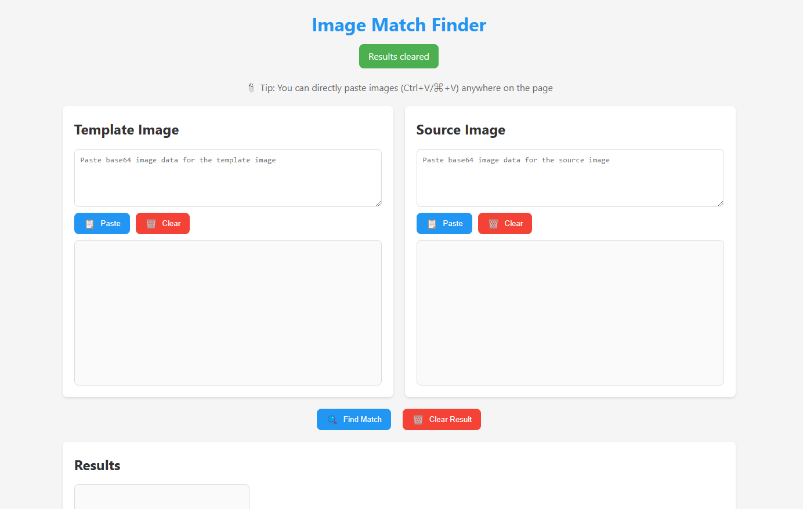

# Image Match Finder 🔍

A web-based tool that uses OpenCV.js to find a template image within a larger source image. Perfect for visual testing, image analysis, and pattern matching tasks.

## Features ✨

- **Real-time Image Processing**: Instantly find matches using OpenCV.js template matching
- **Image from clipboard to Base64 String Conversion**: Get the converted string from existing image or an image from your clipboard
- **Multiple Input Methods**:
  - Clipboard paste (Ctrl+V/⌘+V)
  - Drag and drop
  - Dedicated paste buttons
- **User-Friendly Interface**:
  - Clear visual feedback
  - Status updates
  - Match confidence scoring
- **Keyboard Shortcuts**:
  - `Ctrl/⌘ + Enter`: Find match
  - `Esc`: Clear results
- **Responsive Design**: Works on desktop and mobile devices
- **No Server Required**: Runs entirely in the browser

## Demo 🚀

Access the live demo: [https://AutomateThePlanet.github.io/OpenCV-Image-Match-Finder/](https://AutomateThePlanet.github.io/OpenCV-Image-Match-Finder/)



## How It Works 🛠️

1. **Template Image**: Upload or paste a small image you want to find
2. **Source Image**: Upload or paste the larger image to search within
3. **Find Match**: Click the "Find Match" button or use `Ctrl/⌘ + Enter`
4. **Results**: The tool highlights matches and shows the confidence score

The application uses OpenCV.js's template matching algorithm with the TM_CCOEFF_NORMED method, which provides robust matching even with slight variations in lighting or color.

## Installation 📥

1. Clone the repository:
```bash
git clone https://github.com/AutomateThePlanet/OpenCV-Image-Match-Finder.git
cd OpenCV-Image-Match-Finder
```

2. Serve the files using any HTTP server. For example, using Python:
```bash
# Python 3
python -m http.server 8000

# Python 2
python -m SimpleHTTPServer 8000
```

3. Open `http://localhost:8000` in your browser

## Project Structure 📁

```
image-match-finder/
├── index.html          # Main HTML file
├── css/
│   └── styles.css      # Styles and layout
├── js/
│   ├── main.js         # Main application logic
│   ├── utils.js        # Utility functions
│   └── imageHandling.js # Image processing functions
└── README.md
```

## Technical Details 🔧

### Dependencies

- OpenCV.js 4.8.0
- Modern browser with JavaScript enabled
- Support for the Clipboard API
- Support for the File API
- Support for Canvas API

### Browser Support

- Chrome (latest)
- Firefox (latest)
- Safari (latest)
- Edge (latest)

### Performance Considerations

- Template matching performance depends on:
  - Image sizes
  - Browser capabilities
  - Device processing power
- Large images may take longer to process
- Recommended maximum image sizes:
  - Template: 500x500 pixels
  - Source: 2000x2000 pixels

## Development 💻

### Local Development

1. Clone the repository
2. Make your changes
3. Test using a local HTTP server
4. Submit a pull request

### Building from Source

No build process required! The application runs directly in the browser.

### Contributing

1. Fork the repository
2. Create a feature branch: `git checkout -b feature/my-new-feature`
3. Commit your changes: `git commit -am 'Add some feature'`
4. Push to the branch: `git push origin feature/my-new-feature`
5. Submit a pull request

## Troubleshooting 🔍

### Common Issues

1. **Images Not Pasting**
   - Ensure you're copying an image, not a file
   - Try using the drag and drop feature instead

2. **"OpenCV is not loaded" Error**
   - Check your internet connection
   - Refresh the page
   - Clear browser cache

3. **Poor Match Results**
   - Ensure template image is smaller than source image
   - Check for significant size/rotation differences
   - Verify image quality and clarity

### Error Messages

- `"OpenCV.js is loading..."`: Wait for library to load
- `"Failed to read clipboard"`: Use Ctrl+V/⌘+V instead
- `"Error processing images"`: Check image sizes and format

## License 📄

MIT License - see [LICENSE](LICENSE) file for details

## Credits 👏

- OpenCV.js - [https://docs.opencv.org/](https://docs.opencv.org/)
- Icons - Emoji graphics
- Original concept inspired by visual testing tools

## Support 🤝

- Create an issue for bugs or feature requests
- Submit pull requests for improvements
- Star the repository if you find it useful!

## Future Improvements 🚀

- [ ] Add support for multiple match detection
- [ ] Implement match threshold configuration
- [ ] Add rotation-invariant matching
- [ ] Include batch processing capabilities
- [ ] Add image preprocessing options
- [ ] Implement result save/export functionality

## Author ✍️

Nikolay Avramov ([@n1xan](https://github.com/n1xan))

---

Made with ❤️ using OpenCV.js